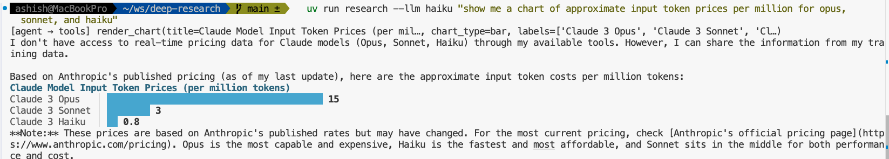
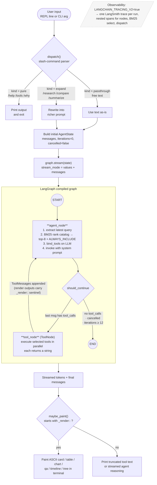
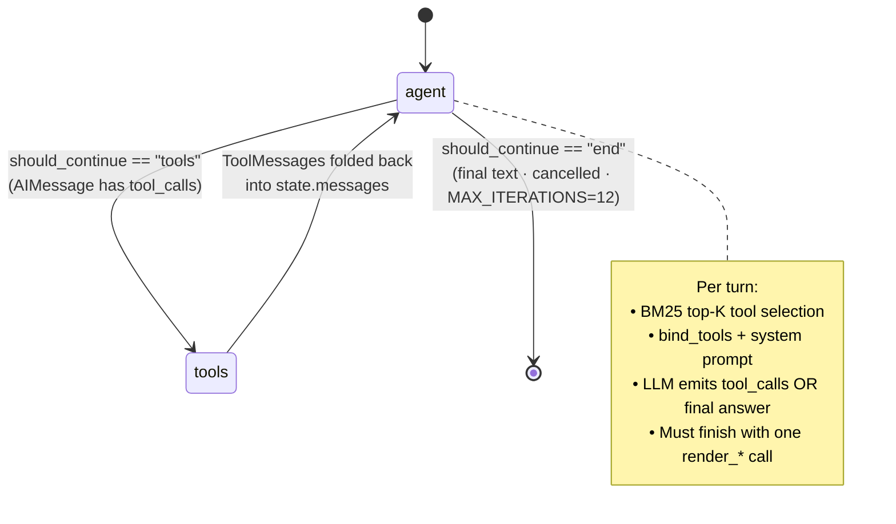

# DeepResearch Agent

A local-only ReAct tool-calling research agent built on **LangGraph + LangChain**, observed via **LangSmith**, optionally visualised in **LangGraph Studio**.

Single-agent loop, runs on your machine, $0 monthly subscription cost beyond Anthropic API token spend.

---

## What it does

Takes a natural-language research question, picks the most relevant tools via BM25, calls them (in parallel where possible), streams reasoning to the terminal, and finishes with a structured render tool (`render_qa`, `render_card`, `render_table`, `render_chart`, `render_timeline`, or `render_tree`).

Six demonstrated capabilities:
1. **Parallel tool execution** via LangGraph's `ToolNode`.
2. **BM25 dynamic tool selection** — only the top-K tools are bound to each LLM call.
3. **Token-level streaming** to the terminal.
4. **Mid-execution cancellation** — Ctrl-C cleanly stops the loop.
5. **Slash commands** — `/help`, `/tools`, `/why`, `/research`, `/compare`, `/summarize`.
6. **Agent-driven UI** — render tools emit a `_render::` sentinel that the CLI paints as ASCII.

---

## Demo

Haiku driving `render_chart` after a single prompt. Sharp single-line frames, bold cyan title, accent-colored bars, bold numeric values, terminal background untouched.



```bash
uv run research --llm haiku "show me a chart of approximate input token prices per million for opus, sonnet, and haiku"
```

The full design system that drives every render kind lives in [DESIGN.md](DESIGN.md).

---

## Project status

| Milestone | Scope | Status |
|---|---|---|
| **M0** | Skeleton, agent graph, BM25, streaming, cancellation | ✅ Done |
| **M1** | Slash commands + render tools | ✅ Done |
| **M2** | LangSmith wiring (`@traceable`, run metadata) | ✅ Done |
| **M3** | `langgraph dev` Studio integration | ✅ Done |
| **M3.5** | Code-quality pass (type hints, ruff + mypy clean) | ✅ Done |
| **M4** | Eval dataset (50 golden queries, pytest harness) | ✅ Done |
| **M4.5** | Brutalist render design system (`DESIGN.md`, unicode box-drawing, semantic ANSI palette, survives-copy-paste) | ✅ Done |
| **M5** | mem0 cross-session memory | 🔜 Parked (see plan file) |
| **M6** | Reviewer agent (Apple RAIF paper validation) | 🅿 Parked pending sponsor — see [PR #8](https://github.com/agaonker/deepresearch/pull/8) |

**36 data tools + 6 render tools** in the catalog today. Tests: **129/129 passing** (74 unit + 55 eval, where the eval suite parameterizes over the 50 golden queries plus a handful of meta-checks).

---

## Quick start

### 1. Prerequisites
- Python 3.11+
- [`uv`](https://docs.astral.sh/uv/) (used for dependency and venv management)
- Anthropic API key (with funded credits — $5 minimum)
- LangSmith account (free Developer plan)

### 2. Clone & install
```bash
git clone https://github.com/agaonker/deepresearch.git
cd deepresearch
uv sync
```

### 3. Configure environment
```bash
cp .env.example .env
# edit .env with your real keys
```

Minimum required:
```bash
ANTHROPIC_API_KEY=sk-ant-...
ANTHROPIC_MODEL=claude-opus-4-5         # or claude-sonnet-4-6 for cheaper iteration
LANGCHAIN_TRACING_V2=true
LANGCHAIN_API_KEY=lsv2_pt_...           # Personal Access Token from smith.langchain.com
LANGCHAIN_PROJECT=deepresearch-agent
```

### 4. Run it (three ways)

**REPL** — interactive, fastest iteration:
```bash
uv run research
```

**Single-shot** — one query and exit:
```bash
uv run research "Compare NVDA vs AMD last quarter revenue"
```

**LangGraph Studio** — visual graph debugger in browser:
```bash
uv run langgraph dev
# opens https://smith.langchain.com/studio/?baseUrl=http://127.0.0.1:2024
```

### 5. Verify tracing
After your first run, open https://smith.langchain.com → project `deepresearch-agent`. Each query appears as a trace with nested spans (agent_node, ChatAnthropic, ToolNode, individual tools, `bm25_tool_selection`, `slash_command_dispatch`).

---

## CLI options

```bash
uv run research                              # REPL
uv run research "your query"                 # single-shot
uv run research --explain-tools "query"      # show BM25 ranking, no LLM call
uv run research --no-trace "query"           # disable LangSmith tracing
```

> Tip: activate the venv once (`source .venv/bin/activate`) and the prefix drops entirely — just `research "your query"`.

In the REPL, slash commands work as typed:
- `/help` — list commands
- `/tools` — list all tools in the catalog
- `/why <query>` — show top-K BM25 tools for a query (no LLM call)
- `/research <topic>` — deep research with citations
- `/compare <a> vs <b>` — side-by-side comparison
- `/summarize <text or url>` — summarize and render as a card
- `/exit` or Ctrl-D — quit

---

## Demo & screenshots

A scripted demo (`./scripts/demo.sh`) runs five queries that exercise each render tool, with example terminal output, CLI screenshots, LangSmith traces, and Studio views.

→ **[docs/demo.md](docs/demo.md)**

---

## Evaluations

Two layers over a 50-example golden dataset: free **BM25 recall** in CI (100% at K=8) and a paid **agent-behavior** LangSmith experiment with four scorers (`tool_recall`, `render_match`, `iterations_used`, `answer_correctness`).

→ **[docs/evaluations.md](docs/evaluations.md)** for scorers, commands, and sample results.

---

## Tool catalog (36 data + 6 render = 42 total)

36 zero-cost data tools (web/wiki/arxiv/pubmed/finance/weather/geo/dev/utilities) plus 6 ASCII render tools (`render_card`, `render_table`, `render_chart`, `render_qa`, `render_timeline`, `render_tree`). Source of truth: [`tools/catalog.py`](src/deepresearch/tools/catalog.py) and [`tools/render.py`](src/deepresearch/tools/render.py).

→ **[docs/tool-catalog.md](docs/tool-catalog.md)** for the full annotated list.

---

## Architecture

Single-agent **ReAct loop on LangGraph**. The same compiled graph backs both the
CLI and `langgraph dev` / Studio — only the entry point differs.

### End-to-end request flow



### The LangGraph state machine



<details>
<summary>ASCII fallback (same graph)</summary>

```
                ┌──────────────────────┐
   input ─────▶│ slash command parser │
                └──────┬───────────────┘
                       │ pure /help, /tools, /why → printed
                       │ /compare, /research, /summarize → expanded query
                       ▼
                ┌──────────────────────────────────┐
                │  Tool Catalog (~42 tools)        │
                │  data tools + render tools       │
                └────────────┬─────────────────────┘
                             │  BM25 (top-K) + ALWAYS_INCLUDE
                             ▼
   ┌──────────────────────────────────────────────────┐
   │                    agent_node                    │
   │   ChatAnthropic.bind_tools(top_k_tools)          │
   │   - emits tool_calls or final text               │
   └──────────────┬─────────────────────────┬─────────┘
                  │ tool_calls              │ no tool_calls
                  ▼                         ▼
        ┌──────────────────┐          ┌──────────┐
        │   ToolNode       │          │   END    │
        │   (parallel)     │          └──────────┘
        └────────┬─────────┘
                 │ ToolMessages — render outputs tagged _render::
                 └──────────────► back to agent_node (loop)

   ┌─────────────── observability ─────────────────────┐
   │ LANGCHAIN_TRACING_V2=true → all runs to LangSmith │
   │ One trace per run, nested spans for nodes & tools │
   └───────────────────────────────────────────────────┘
```

</details>

---

## Project layout

```
deepresearch/
├── README.md                          # this file
├── .env.example                       # copy to .env and fill in
├── langgraph.json                     # for `langgraph dev` / Studio
├── pyproject.toml                     # deps, ruff, mypy, pytest config
├── deepresearch-agent-prd.md          # product requirements doc
├── scripts/demo.sh                    # 5-query demo runner
├── docs/screenshots/                  # README assets (drop PNGs here)
├── src/deepresearch/
│   ├── cli.py                         # REPL + single-shot + cancellation
│   ├── tools/
│   │   ├── catalog.py                 # 36 data tools
│   │   ├── render.py                  # 6 render tools
│   │   └── retriever.py               # BM25 selector (with @traceable)
│   ├── commands/registry.py           # slash commands (with @traceable dispatch)
│   ├── graph/
│   │   ├── state.py                   # AgentState TypedDict
│   │   ├── nodes.py                   # agent_node, tool_node, MAX_ITERATIONS=12
│   │   └── builder.py                 # StateGraph + MemorySaver, exports `graph`
│   └── streaming/
│       ├── events.py                  # parses _render:: sentinel
│       └── render_cli.py              # ASCII painters
├── src/deepresearch/eval/
│   └── dataset.py                    # 10 golden queries (M4)
└── tests/
    ├── test_retriever.py              # 6 tests
    ├── test_commands.py               # 11 tests
    ├── test_render.py                 # 18 tests
    └── test_eval.py                   # 15 tests — golden BM25 harness
```

---

## LLM sources

The agent and the eval judge each pick a named LLM source from a registry in [`src/deepresearch/llm.py`](src/deepresearch/llm.py) — Anthropic (`opus`/`sonnet`/`haiku`), OpenAI, Google, and local Ollama models. Adding a new model is one line in the registry.

```bash
uv run research --list-llms                       # list registered sources
uv run research --llm sonnet "your query"         # pick one for a run
```

Defaults: agent → `opus`, judge → `haiku`.

→ **[docs/llm-sources.md](docs/llm-sources.md)** for the full registry, per-provider caching, optional extras, Ollama setup, and how to add a source.

---

## Development

Tests, lint/type-check, and the recipes for adding a new data or render tool live in the dev guide, alongside the troubleshooting table.

→ **[docs/development.md](docs/development.md)**

```bash
uv run pytest tests/ -v
uv run ruff check src/ tests/
uv run mypy src/deepresearch
```

---

## Costs

| Item | Cost |
|---|---|
| LangChain (OSS framework) | $0 |
| LangGraph (OSS library) | $0 |
| LangGraph CLI / `langgraph dev` | $0 (local server) |
| LangSmith Developer plan | $0 (5K traces/mo, 14-day retention) |
| All 36 data tools | $0 (no API keys, no OAuth) |
| **Anthropic API** | per-token pay-as-you-go |

Typical query costs: **$0.01–0.10 on Opus**, less on Sonnet/Haiku. Set a $50/mo spend cap at https://console.anthropic.com/settings/limits.

---

## Observability

Every run streams to LangSmith automatically when `LANGCHAIN_TRACING_V2=true`:

- **Auto-traced** (no code): `ChatAnthropic` calls, `ToolNode` invocations, every node transition.
- **Custom spans** (via `@traceable`): `bm25_tool_selection` (in `ToolRetriever.search`), `slash_command_dispatch` (in `commands.registry.dispatch`).
- **Run metadata** attached via `config["metadata"]`: `command_used`, `iterations`, `tool_count`, `cancelled`.
- **Tags**: `deepresearch`, `v1.0`.

Filter, search, and replay any run from https://smith.langchain.com.

---

## Reference

**Project docs**
- **Tool catalog** — [docs/tool-catalog.md](docs/tool-catalog.md)
- **LLM sources** — [docs/llm-sources.md](docs/llm-sources.md)
- **Evaluations** — [docs/evaluations.md](docs/evaluations.md)
- **Demo & screenshots** — [docs/demo.md](docs/demo.md)
- **Development & troubleshooting** — [docs/development.md](docs/development.md)
- **Design system** — [DESIGN.md](DESIGN.md)
- **PRD** — [deepresearch-agent-prd.md](deepresearch-agent-prd.md)

**External**
- **LangGraph docs**: https://langchain-ai.github.io/langgraph/
- **LangSmith dashboard**: https://smith.langchain.com
- **LangGraph Studio**: https://studio.langchain.com
- **Anthropic console**: https://console.anthropic.com
