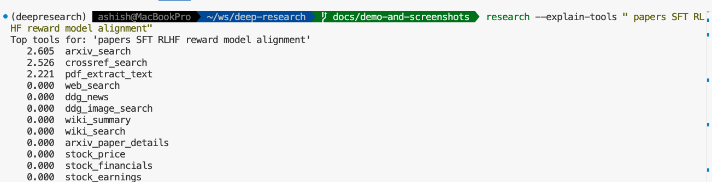
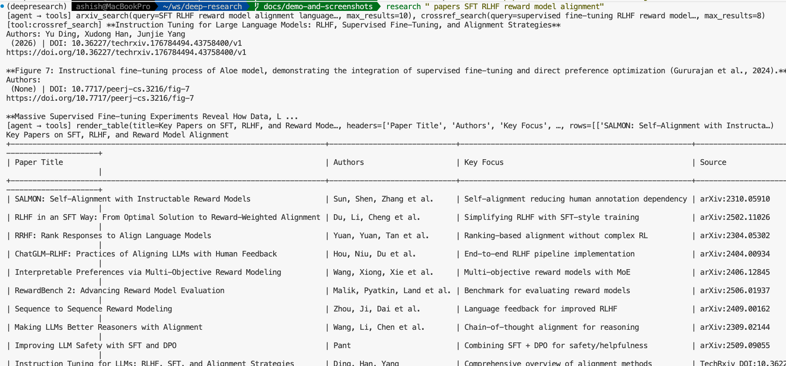
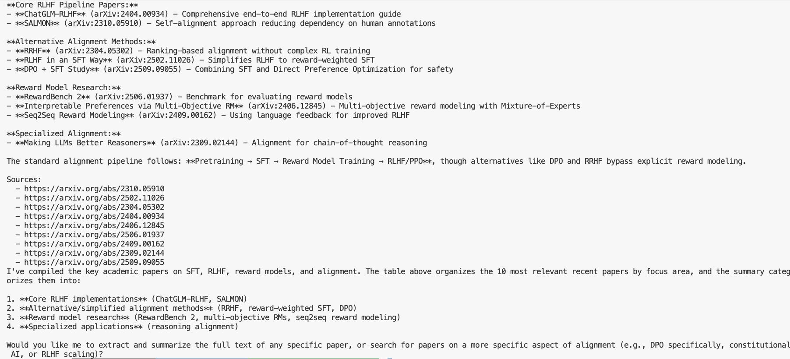
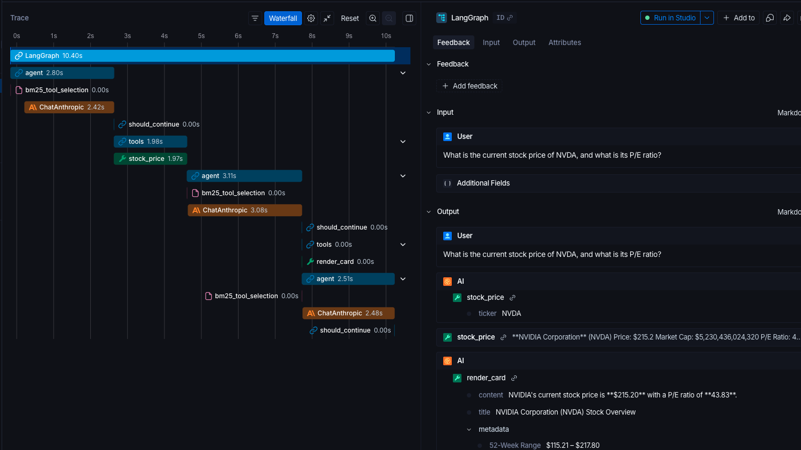
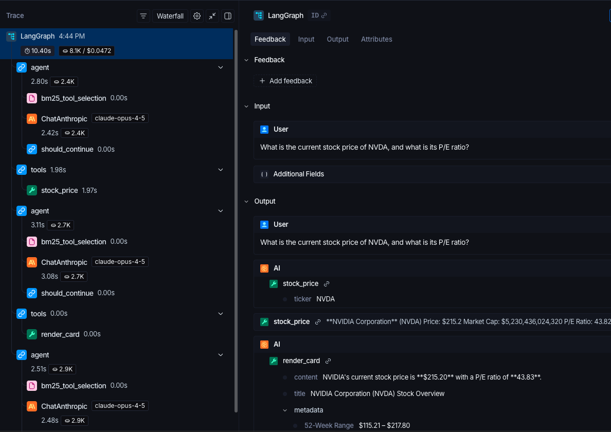
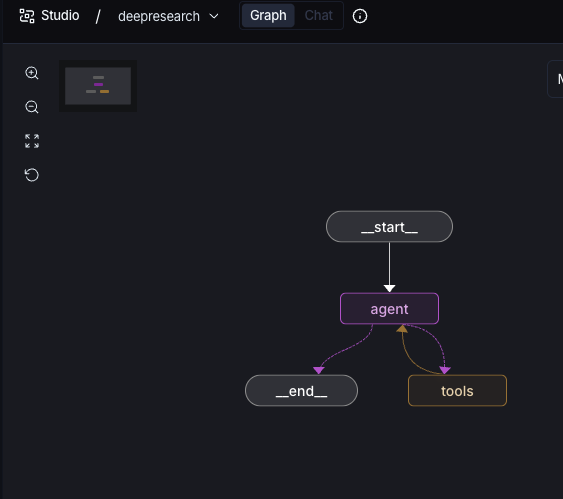
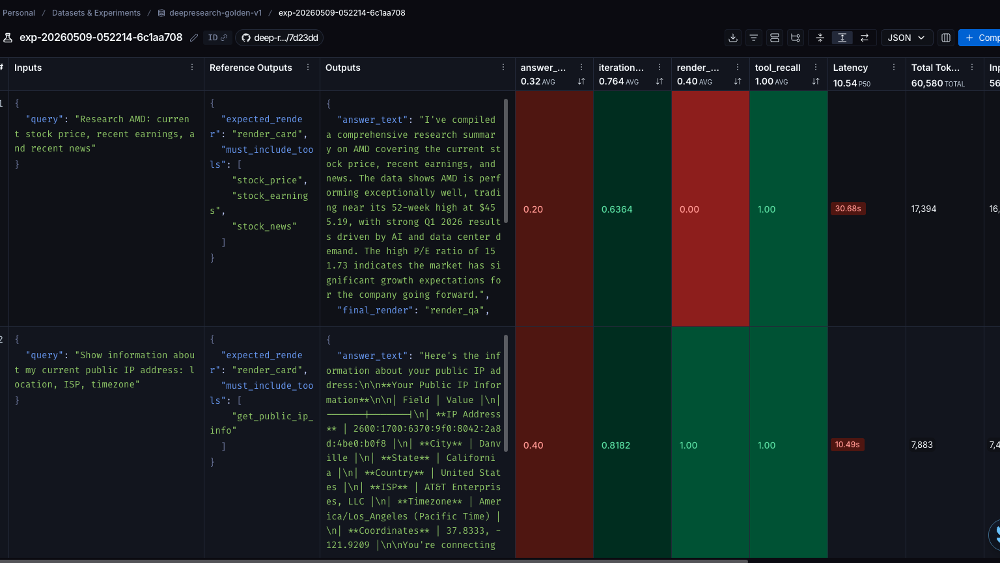
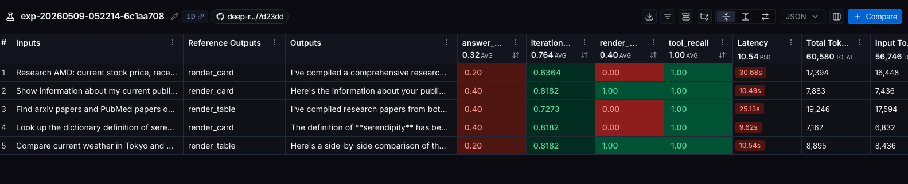

# DeepResearch Agent

A local-only ReAct tool-calling research agent built on **LangGraph + LangChain**, observed via **LangSmith**, optionally visualised in **LangGraph Studio**.

Single-agent loop, runs on your machine, $0 monthly subscription cost beyond Anthropic API token spend.

---

## What it does

Takes a natural-language research question, picks the most relevant tools via BM25, calls them (in parallel where possible), streams reasoning to the terminal, and finishes with a structured render tool (`render_qa`, `render_card`, `render_table`, `render_chart`, `render_timeline`, or `render_tree`).

Six demonstrated capabilities:
1. **Parallel tool execution** via LangGraph's `ToolNode`.
2. **BM25 dynamic tool selection** — only the top-K tools are bound to each LLM call.
3. **Token-level streaming** to the terminal.
4. **Mid-execution cancellation** — Ctrl-C cleanly stops the loop.
5. **Slash commands** — `/help`, `/tools`, `/why`, `/research`, `/compare`, `/summarize`.
6. **Agent-driven UI** — render tools emit a `_render::` sentinel that the CLI paints as ASCII.

---

## Project status

| Milestone | Scope | Status |
|---|---|---|
| **M0** | Skeleton, agent graph, BM25, streaming, cancellation | ✅ Done |
| **M1** | Slash commands + render tools | ✅ Done |
| **M2** | LangSmith wiring (`@traceable`, run metadata) | ✅ Done |
| **M3** | `langgraph dev` Studio integration | ✅ Done |
| **M3.5** | Code-quality pass (type hints, ruff + mypy clean) | ✅ Done |
| **M4** | Eval dataset (10 golden queries, pytest harness) | ✅ Done |
| **M5** | mem0 cross-session memory | 🔜 Parked (see plan file) |

**36 data tools + 6 render tools** in the catalog today. Tests: **50/50 passing** (35 unit + 15 eval).

---

## Quick start

### 1. Prerequisites
- Python 3.11+
- [`uv`](https://docs.astral.sh/uv/) (used for dependency and venv management)
- Anthropic API key (with funded credits — $5 minimum)
- LangSmith account (free Developer plan)

### 2. Clone & install
```bash
git clone https://github.com/agaonker/deepresearch.git
cd deepresearch
uv sync
```

### 3. Configure environment
```bash
cp .env.example .env
# edit .env with your real keys
```

Minimum required:
```bash
ANTHROPIC_API_KEY=sk-ant-...
ANTHROPIC_MODEL=claude-opus-4-5         # or claude-sonnet-4-6 for cheaper iteration
LANGCHAIN_TRACING_V2=true
LANGCHAIN_API_KEY=lsv2_pt_...           # Personal Access Token from smith.langchain.com
LANGCHAIN_PROJECT=deepresearch-agent
```

### 4. Run it (three ways)

**REPL** — interactive, fastest iteration:
```bash
uv run research
```

**Single-shot** — one query and exit:
```bash
uv run research "Compare NVDA vs AMD last quarter revenue"
```

**LangGraph Studio** — visual graph debugger in browser:
```bash
uv run langgraph dev
# opens https://smith.langchain.com/studio/?baseUrl=http://127.0.0.1:2024
```

### 5. Verify tracing
After your first run, open https://smith.langchain.com → project `deepresearch-agent`. Each query appears as a trace with nested spans (agent_node, ChatAnthropic, ToolNode, individual tools, `bm25_tool_selection`, `slash_command_dispatch`).

---

## CLI options

```bash
uv run research                              # REPL
uv run research "your query"                 # single-shot
uv run research --explain-tools "query"      # show BM25 ranking, no LLM call
uv run research --no-trace "query"           # disable LangSmith tracing
```

> Tip: activate the venv once (`source .venv/bin/activate`) and the prefix drops entirely — just `research "your query"`.

In the REPL, slash commands work as typed:
- `/help` — list commands
- `/tools` — list all tools in the catalog
- `/why <query>` — show top-K BM25 tools for a query (no LLM call)
- `/research <topic>` — deep research with citations
- `/compare <a> vs <b>` — side-by-side comparison
- `/summarize <text or url>` — summarize and render as a card
- `/exit` or Ctrl-D — quit

---

## Demo & screenshots

A scripted demo runs five queries chosen to exercise each render tool — handy for smoke-testing a fresh checkout, generating LangSmith traces, and capturing example output.

```bash
./scripts/demo.sh                 # all 5 queries with LangSmith tracing on
./scripts/demo.sh --no-trace      # skip LangSmith
./scripts/demo.sh --explain-only  # BM25 ranking only, no LLM call (free)
./scripts/demo.sh 3               # only run query #3
```

| # | Expected render | Query |
|---|---|---|
| 1 | `render_qa` | Current stock price + P/E for NVDA |
| 2 | `render_card` | 5-sentence Wikipedia summary of the French Revolution |
| 3 | `render_table` | NVDA vs AMD: market cap, P/E, 52-week range |
| 4 | `render_chart` | India GDP, World Bank, 2015–2023 |
| 5 | `render_timeline` | Major SpaceX launches, 2008–2024 |

### Example terminal output

Demo #1 captured live — the agent picks `stock_price`, then renders a card:

```text
[agent → tools] stock_price(ticker=NVDA)
[tool:stock_price] **NVIDIA Corporation** (NVDA)
Price: $215.2
Market Cap: $5,230,436,024,320
P/E Ratio: 43.828922
52W Range: 115.21 – 217.8
Volume: 134,128,204
[agent → tools] render_card(title=NVIDIA Corporation (NVDA) Stock Overview, ...)
+----------------------------------------------------------------------------+
| NVIDIA Corporation (NVDA) Stock Overview                                   |
+----------------------------------------------------------------------------+
| NVIDIA's current stock price is **$215.20** with a P/E ratio of **43.83**. |
+----------------------------------------------------------------------------+
| Current Price: $215.20                                                     |
| P/E Ratio: 43.83                                                           |
| Market Cap: $5.23 Trillion                                                 |
| 52-Week Range: $115.21 – $217.80                                           |
| Volume: 134,128,204                                                        |
+----------------------------------------------------------------------------+
```

### CLI in action

`--explain-tools` prints the BM25 ranking for a query without calling the LLM — useful for debugging tool selection:



A real run on the same topic — agent calls `arxiv_search`, then renders a comparison table of papers:



The agent then writes a narrative summary with cited source URLs:



### LangSmith traces

Every run with `LANGCHAIN_TRACING_V2=true` shows up at https://smith.langchain.com → project `deepresearch-agent`.

The waterfall view shows the full ReAct loop end-to-end — `agent_node` → `bm25_tool_selection` → `ChatAnthropic` → `tools` (`stock_price`) → back to `agent` → render:



The vertical tree view of the same trace shows per-node timing, token counts, and the model in use:



### LangGraph Studio

Run the same compiled graph in the visual debugger:

```bash
uv run langgraph dev
```



> See [`docs/screenshots/README.md`](docs/screenshots/README.md) for a capture checklist (which views to shoot, file naming, sizing).

---

## Evaluations

Two layers of eval, both using the same 50-example golden dataset (`src/deepresearch/eval/dataset.py`, mirrored to LangSmith as `deepresearch-golden-v1`):

1. **BM25 recall** (free, deterministic, runs in CI) — `tests/test_eval.py` asserts that for every golden query, the BM25 retriever's top-K includes the expected tools. Currently 100% recall at K=8.
2. **Agent behavior** (LangSmith experiment, paid) — `scripts/run_experiment.py` runs the compiled graph against each example and uploads scores to LangSmith.

```bash
uv run python scripts/run_experiment.py                 # 5 examples, ~$0.30 (smoke test)
uv run python scripts/run_experiment.py --limit 50      # full pass, ~$2.75
uv run python scripts/run_experiment.py --no-llm-judge  # skip Haiku, free programmatic only
```

### Scorers

| Scorer | Type | What it measures |
|---|---|---|
| `tool_recall` | programmatic | Fraction of `must_include_tools` actually called |
| `render_match` | programmatic | 1.0 if the run finished with the expected render tool |
| `iterations_used` | programmatic | Inverted cost — 1.0 for a single iteration, 0.0 at the 12-iteration cap |
| `answer_correctness` | Haiku-as-judge (~$0.005/run) | 1–5 rating from a strict evaluator, normalized to 0–1 |

### Sample experiment results

A 5-example smoke test (experiment `exp-20260509-052214-6c1aa708`):



Per-row scores:



| Scorer | Avg on 5 runs | Read |
|---|---|---|
| `tool_recall` | **1.00** | Perfect — agent always reaches the BM25-expected tool. |
| `iterations_used` | **0.76** | Healthy — most runs finish in 3–4 ReAct loops. |
| `render_match` | **0.40** | 2 of 5 hit the expected render. The agent often picks `render_card` when the dataset prescribes `render_table` — the LLM uses its own judgment for render shape. |
| `answer_correctness` | **0.32** | Haiku is grading 1–2/5 on most answers. The judge prompt is strict and lacks ground truth — first-cut signal, needs prompt tuning. |

Cost on the smoke pass: ~60K tokens, latency 9–30s per run.

---

## Tool catalog (36 data + 6 render = 42 total)

> Source of truth: [`src/deepresearch/tools/catalog.py`](src/deepresearch/tools/catalog.py) and [`src/deepresearch/tools/render.py`](src/deepresearch/tools/render.py). The list below is generated to match.

### Data tools (36)

**Web search & news** (5)
| Tool | Description |
|---|---|
| `web_search` | DuckDuckGo web search — titles, URLs, snippets. |
| `ddg_news` | DuckDuckGo News — recent headlines and summaries. |
| `ddg_image_search` | DuckDuckGo image search — image metadata + URLs. |
| `hackernews_search` | Hacker News stories and comments via public Algolia API. |
| `reddit_search` | Reddit posts via the public JSON endpoint (no auth). |

**Encyclopedic & factual** (4)
| Tool | Description |
|---|---|
| `wiki_summary` | Concise Wikipedia summary for a topic. |
| `wiki_search` | List of Wikipedia article titles matching a query. |
| `wikidata_query` | Run a SPARQL query against Wikidata for structured facts. |
| `get_country_info` | Country profile — capital, population, region, languages, currencies. |

**Academic literature** (4)
| Tool | Description |
|---|---|
| `arxiv_search` | Search arXiv for papers, preprints, scientific research. |
| `arxiv_paper_details` | Full metadata for a specific arXiv paper by ID. |
| `pubmed_search` | Biomedical and life-sciences literature via NCBI E-utilities. |
| `crossref_search` | Academic papers and DOI metadata across all disciplines. |

**Finance & markets** (6)
| Tool | Description |
|---|---|
| `stock_price` | Current price + key metrics (cap, P/E, 52-week range) for a ticker. |
| `stock_financials` | Annual financial statements — revenue, net income, EBITDA. |
| `stock_earnings` | Recent earnings history and upcoming earnings dates. |
| `stock_news` | Recent news headlines for a ticker (Yahoo Finance). |
| `market_summary` | S&P 500, Dow, NASDAQ snapshot. |
| `coingecko_price` | Current cryptocurrency prices via CoinGecko (no API key). |

**Geography & weather** (3)
| Tool | Description |
|---|---|
| `osm_geocode` | Address/place → coordinates via OSM Nominatim. |
| `weather_now` | Current weather + short forecast via wttr.in. |
| `open_meteo_forecast` | Multi-day forecast via Open-Meteo. |

**Macro & demographics** (1)
| Tool | Description |
|---|---|
| `world_bank_indicator` | World Bank indicator time-series (GDP, population, life expectancy, …). |

**Web fetch & document extraction** (3)
| Tool | Description |
|---|---|
| `fetch_url` | Fetch a web page and return readable text (HTML stripped). |
| `fetch_url_headers` | Fetch HTTP response headers without downloading the body. |
| `pdf_extract_text` | Extract text from a PDF (URL or local path). |

**Multimedia** (1)
| Tool | Description |
|---|---|
| `youtube_transcript` | Fetch the captions/transcript for a YouTube video. |

**Developer ecosystem** (2)
| Tool | Description |
|---|---|
| `get_github_repo` | Public GitHub repo info — stars, forks, language, license. |
| `search_pypi` | PyPI package metadata — version, summary, author, license. |

**Utilities** (7)
| Tool | Description |
|---|---|
| `calculate` | Evaluate a math expression safely. |
| `get_current_datetime` | Current date/time in a given timezone. |
| `convert_units` | Convert between physical units (length, mass, temperature, …) via pint. |
| `currency_convert` | Convert between currencies at live exchange rates. |
| `define_word` | English dictionary lookup via Free Dictionary API. |
| `get_public_ip_info` | Geolocation/ISP info for the host's public IP. |
| `summarize_text` | Truncate or summarize long text to a word limit. |

### Render tools (6)

Each emits a `_render::<kind>\n<json>` sentinel that the CLI parses and paints as ASCII.

| Tool | Description |
|---|---|
| `render_card` | Info card with a title and content body. |
| `render_table` | ASCII table with headers and rows. |
| `render_chart` | ASCII bar or line chart. |
| `render_qa` | Question/answer pair with optional source citations. |
| `render_timeline` | Chronological list of events. |
| `render_tree` | Indented hierarchical tree. |

---

## Architecture

```
                ┌──────────────────────┐
   input ─────▶│ slash command parser │
                └──────┬───────────────┘
                       │ pure /help, /tools, /why → printed
                       │ /compare, /research, /summarize → expanded query
                       ▼
                ┌──────────────────────────────────┐
                │  Tool Catalog (~42 tools)        │
                │  data tools + render tools       │
                └────────────┬─────────────────────┘
                             │  BM25 (top-K) + ALWAYS_INCLUDE
                             ▼
   ┌──────────────────────────────────────────────────┐
   │                    agent_node                    │
   │   ChatAnthropic.bind_tools(top_k_tools)          │
   │   - emits tool_calls or final text               │
   └──────────────┬─────────────────────────┬─────────┘
                  │ tool_calls              │ no tool_calls
                  ▼                         ▼
        ┌──────────────────┐          ┌──────────┐
        │   ToolNode       │          │   END    │
        │   (parallel)     │          └──────────┘
        └────────┬─────────┘
                 │ ToolMessages — render outputs tagged _render::
                 └──────────────► back to agent_node (loop)

   ┌─────────────── observability ─────────────────────┐
   │ LANGCHAIN_TRACING_V2=true → all runs to LangSmith │
   │ One trace per run, nested spans for nodes & tools │
   └───────────────────────────────────────────────────┘
```

Same compiled graph runs in both the CLI and Studio — only the entry point differs.

---

## Project layout

```
deepresearch/
├── README.md                          # this file
├── .env.example                       # copy to .env and fill in
├── langgraph.json                     # for `langgraph dev` / Studio
├── pyproject.toml                     # deps, ruff, mypy, pytest config
├── deepresearch-agent-prd.md          # product requirements doc
├── scripts/demo.sh                    # 5-query demo runner
├── docs/screenshots/                  # README assets (drop PNGs here)
├── src/deepresearch/
│   ├── cli.py                         # REPL + single-shot + cancellation
│   ├── tools/
│   │   ├── catalog.py                 # 36 data tools
│   │   ├── render.py                  # 6 render tools
│   │   └── retriever.py               # BM25 selector (with @traceable)
│   ├── commands/registry.py           # slash commands (with @traceable dispatch)
│   ├── graph/
│   │   ├── state.py                   # AgentState TypedDict
│   │   ├── nodes.py                   # agent_node, tool_node, MAX_ITERATIONS=12
│   │   └── builder.py                 # StateGraph + MemorySaver, exports `graph`
│   └── streaming/
│       ├── events.py                  # parses _render:: sentinel
│       └── render_cli.py              # ASCII painters
├── src/deepresearch/eval/
│   └── dataset.py                    # 10 golden queries (M4)
└── tests/
    ├── test_retriever.py              # 6 tests
    ├── test_commands.py               # 11 tests
    ├── test_render.py                 # 18 tests
    └── test_eval.py                   # 15 tests — golden BM25 harness
```

---

## LLM sources

The agent and the eval judge each pick a named LLM source from a registry in [`src/deepresearch/llm.py`](src/deepresearch/llm.py). Adding a new model is one line in the registry, not a new branch in the call sites.

### Registered sources

```bash
uv run research --list-llms       # print the table below at any time
```

| Source | Provider | Model | Cache | Notes |
|---|---|---|---|---|
| `opus` | anthropic | `claude-opus-4-7` | yes | frontier; best tool calling and reasoning |
| `sonnet` | anthropic | `claude-sonnet-4-6` | yes | cheaper iteration; near-Opus quality |
| `haiku` | anthropic | `claude-haiku-4-5-20251001` | — | fast/cheap; default judge |
| `gpt-4o` | openai | `gpt-4o` | auto* | OpenAI flagship multimodal |
| `gpt-4o-mini` | openai | `gpt-4o-mini` | auto* | OpenAI cheap/fast |
| `gemini-2-flash` | google | `gemini-2.0-flash` | auto* | Google Gemini 2 flash |
| `gemma4-e4b` | ollama | `gemma4:e4b` | local | local; tool-call quality lower than Opus |
| `gemma4-e2b` | ollama | `gemma4:e2b` | local | local; smaller/faster than e4b |
| `qwen-7b` | ollama | `qwen2.5:7b` | local | reliable tool calling on local hardware |

\* auto = provider does prefix caching server-side without code action; see "Caching" below.

### Picking a source

```bash
uv run research --llm gemma4-e4b "What is 2+2?"   # CLI flag
AGENT_LLM=sonnet uv run research "your query"     # env var
```

Defaults: agent → `opus`, judge → `haiku`. The judge has its own selector — `JUDGE_LLM=sonnet uv run python scripts/run_experiment.py --limit 5` runs the agent on Opus and the eval judge on Sonnet.

### Provider extras

Anthropic and the core deps are installed by default. Other providers ship as optional extras so you only install what you need:

```bash
uv sync --extra ollama       # adds langchain-ollama
uv sync --extra openai       # adds langchain-openai
uv sync --extra google       # adds langchain-google-genai
uv sync --extra all-llms     # all three
```

If you pick a source whose extra isn't installed, you'll get a clear `ImportError` with the install command.

### Caching across providers

Each provider handles caching differently — we don't try to fake a unified API:

| Provider | Mechanism | What this codebase does |
|---|---|---|
| Anthropic | Explicit `cache_control: ephemeral` block (5-min TTL) | Wired automatically when `supports_prompt_cache=True` (Opus, Sonnet) |
| OpenAI | Auto-caches identical prefixes ≥1024 tokens server-side | Nothing — savings appear in `usage.prompt_tokens_details.cached_tokens` |
| Google | Implicit caching on Gemini 2.5+; explicit `cachedContents` API exists | Plain string for v1; relies on implicit |
| Ollama | Transformer KV cache in the model server's memory | Plain string; set `OLLAMA_KEEP_ALIVE=24h` to keep models warm between sessions |

### Adding a new source

1. Append a one-line entry to `SOURCES` in [`src/deepresearch/llm.py`](src/deepresearch/llm.py).
2. If it's a new provider, add an `_build_<provider>` function (lazy-import the LangChain package) and register it in `_BUILDERS`.
3. If the provider needs an optional extra, add it under `[project.optional-dependencies]` in `pyproject.toml`.

### Local Ollama setup

Requires `ollama serve` running and the model pulled:

```bash
ollama pull gemma4:e4b
OLLAMA_KEEP_ALIVE=24h uv run research --llm gemma4-e4b "your query"
```

Tool-calling quality on local models is lower than Opus — fine for offline iteration, weaker for demos. The 12-iteration cap (`MAX_ITERATIONS`) protects you from runaway loops.

### Legacy env vars

`LLM_PROVIDER`, `ANTHROPIC_MODEL`, `OLLAMA_MODEL`, and `JUDGE_MODEL` still work but emit a `DeprecationWarning`. Migrate to the new `AGENT_LLM` / `JUDGE_LLM` names.

---

## Development

### Run tests
```bash
uv run pytest tests/ -v
```

### Lint and type-check
```bash
uv run ruff check src/ tests/
uv run mypy src/deepresearch
```

### Dependencies
- Add a runtime dep: `uv add <package>`
- Add a dev dep: `uv add --dev <package>`

### Adding a new tool
1. Write a `@tool def my_tool(...) -> str:` function in [src/deepresearch/tools/catalog.py](src/deepresearch/tools/catalog.py).
2. Append it to `ALL_DATA_TOOLS` at the bottom of the file.
3. Wrap external calls in `try/except Exception as e: return f"[my_tool error: {e}]"` (matches existing pattern).
4. Add a unit test in `tests/`.

The BM25 retriever picks new tools up automatically — no other registration needed. Tools listed in `ALWAYS_INCLUDE` (in [retriever.py](src/deepresearch/tools/retriever.py)) are bound on every call regardless of relevance.

### Adding a new render tool
1. Write `@tool def render_xxx(...) -> str:` in [src/deepresearch/tools/render.py](src/deepresearch/tools/render.py), returning `f"{_SENTINEL}xxx\n{json.dumps(payload)}"`.
2. Append it to `ALL_RENDER_TOOLS`.
3. Add a `_paint_xxx(d: dict) -> str:` painter in [src/deepresearch/streaming/render_cli.py](src/deepresearch/streaming/render_cli.py) and register it in `_PAINTERS`.
4. Add tests covering the payload + painter.

---

## Costs

| Item | Cost |
|---|---|
| LangChain (OSS framework) | $0 |
| LangGraph (OSS library) | $0 |
| LangGraph CLI / `langgraph dev` | $0 (local server) |
| LangSmith Developer plan | $0 (5K traces/mo, 14-day retention) |
| All 36 data tools | $0 (no API keys, no OAuth) |
| **Anthropic API** | per-token pay-as-you-go |

Typical query costs: **$0.01–0.10 on Opus**, less on Sonnet/Haiku. Set a $50/mo spend cap at https://console.anthropic.com/settings/limits.

---

## Observability

Every run streams to LangSmith automatically when `LANGCHAIN_TRACING_V2=true`:

- **Auto-traced** (no code): `ChatAnthropic` calls, `ToolNode` invocations, every node transition.
- **Custom spans** (via `@traceable`): `bm25_tool_selection` (in `ToolRetriever.search`), `slash_command_dispatch` (in `commands.registry.dispatch`).
- **Run metadata** attached via `config["metadata"]`: `command_used`, `iterations`, `tool_count`, `cancelled`.
- **Tags**: `deepresearch`, `v1.0`.

Filter, search, and replay any run from https://smith.langchain.com.

---

## Troubleshooting

| Symptom | Likely cause | Fix |
|---|---|---|
| `anthropic.BadRequestError: credit balance is too low` | Account has $0 in credits | Add funds at console.anthropic.com/settings/billing |
| `anthropic.NotFoundError: model: ...` | `ANTHROPIC_MODEL` is wrong | Try `claude-opus-4-5` or `claude-sonnet-4-6` |
| `anthropic.AuthenticationError` | `ANTHROPIC_API_KEY` missing or wrong | Check `.env`, regenerate key if needed |
| No LangSmith trace appears | `LANGCHAIN_TRACING_V2` not `true`, or wrong key | Verify all `LANGCHAIN_*` env vars |
| `langgraph: Required package 'langgraph-api' is not installed` | Missing extra | `uv add --dev "langgraph-cli[inmem]"` |
| Studio shows no graph | `langgraph.json` path wrong | Confirm `src/deepresearch/graph/builder.py:graph` exists |
| `http://127.0.0.1:2024/` is blank in browser | Working as designed — server has no `/` route | Open the Studio URL the CLI prints, or visit `/docs` |
| REPL hangs after Ctrl-C | Caught by SIGINT handler, finishing current step | Hit Ctrl-D to force exit |

---

## Reference

- **PRD**: [deepresearch-agent-prd.md](deepresearch-agent-prd.md)
- **LangGraph docs**: https://langchain-ai.github.io/langgraph/
- **LangSmith dashboard**: https://smith.langchain.com
- **LangGraph Studio**: https://studio.langchain.com
- **Anthropic console**: https://console.anthropic.com
